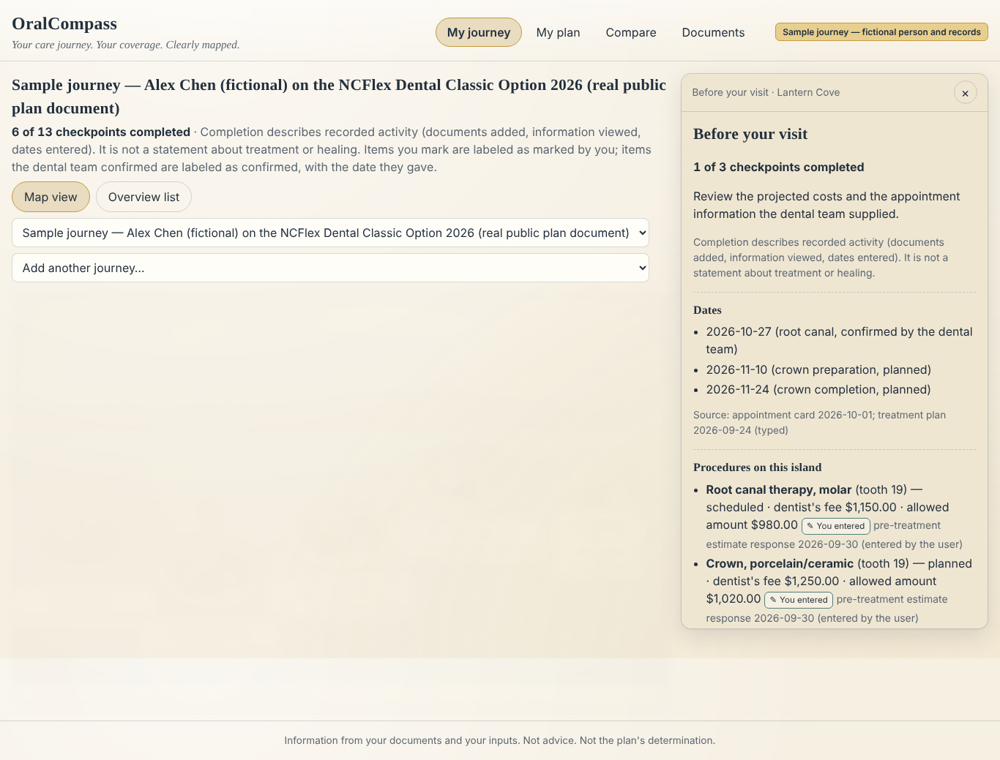
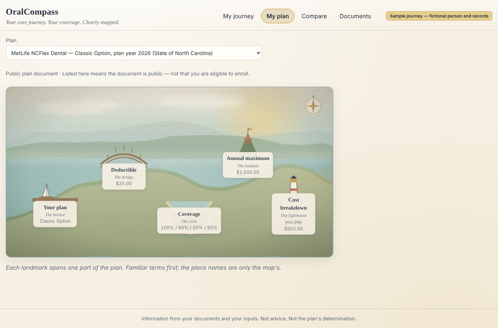
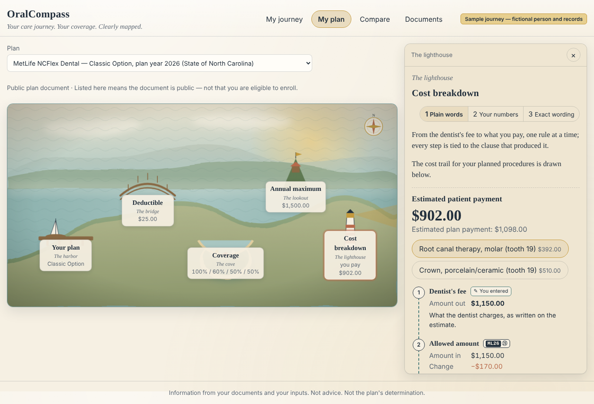
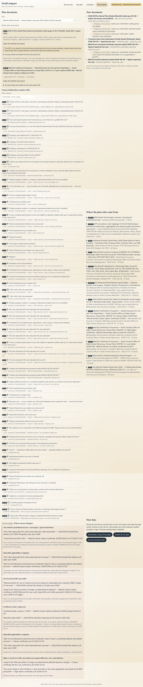
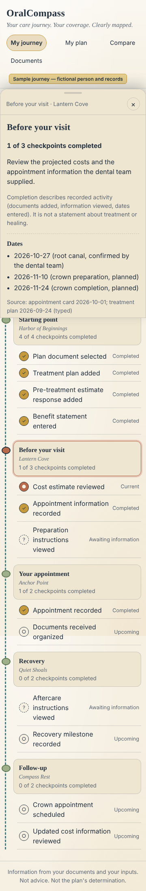
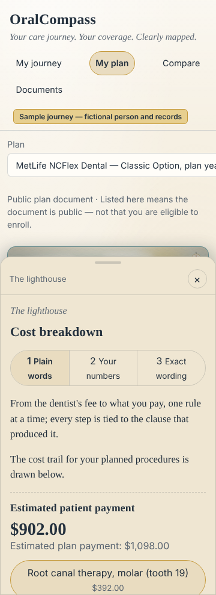

# OralCompass: codeLinc 11, Path 1 (Dental)

*Your care journey. Your coverage. Clearly mapped.*

OralCompass draws a person's dental treatment as a hand-painted sea passage (each procedure an island, each insurance rule a
checkpoint on the route) and their dental plan as a set of landmarks (Your plan, Deductible, Coverage, Annual maximum, Cost breakdown).
Every dollar on the cost trail, from the dentist's fee to "you pay", is computed by a deterministic engine in integer cents and stitched to
the exact clause (document label, page, quote) that produced it. Where a document is silent the app says "Not stated in this document"
instead of filling in a typical value. It is information only: it explains what the documents say and what the arithmetic yields, and the
person makes every decision with their dental team.

## What is real and what is fictional

| Real | Fictional (labeled everywhere) |
|---|---|
| Public plan documents and their quoted clauses: NCFlex MetLife 2026 (Classic, High, Low), Delta Dental MSU 2024 (High, Low), FEDVIP 2026 MetLife and Delta. Facts live in `sources/extracted/*.json` with page and quote; presets are generated by `tools/ingest_sources.py`. | People: Sam Rivera, Jordan, Alex Chen. Practices: Northside Dental Group, Greensboro Family Dental. |
| Procedure codes only as printed in cited public documents (`fixtures/procedure_codes.json`). No CDT catalog is shipped. | Plans HB26 (Harborview), SM26, NW26, TW26 and their PDFs in `fixtures/documents/`. They carry a "fictional plan" ribbon. |
| NC Medicaid fee rows, labeled as benchmarks by payer, geography and date. They never enter an estimate unless typed as a hypothetical. | Every treatment plan, statement and estimate in `fixtures/users/` and `fixtures/estimates/`. |

The two demo journeys, with numbers generated by the engine and asserted in tests (never typed into slides):

- **Alex Chen** (fictional person, real public plan ML26, the 2026 NCFlex Dental Classic option): root canal $392 you / $588 plan, crown
  $510 / $510, totals **$902 you / $1,098 plan**; every step cites `ML26 p.25`; unknown clauses are flagged
  (`engine/tests/test_real_presets.py`, `api/tests/test_records.py`).
- **Sam Rivera** (fictional person, fictional plan HB26 with a stored PDF): in-network **$640 you / $560 plan**; out-of-network $940;
  crown on a premolar $540 / $660; deductible unknown gives the range $640 to $665 (`engine/tests/test_fixture.py`).

## Screenshots

Desktop 1366×900 and phone 360×780, taken by `tools/screenshots.py` from a demo-mode build.

| | |
|---|---|
| My journey (desktop) |  |
| My plan (desktop) |  |
| Harbor Light totals (desktop) |  |
| Documents (desktop) |  |
| My journey (phone) |  |
| Harbor Light (phone) |  |

All images are in `docs/screenshots/` (the walk's `checks.json` sits beside them).

## 60-second start

Requirements: Python 3 (the container uses 3.12), Node 22 with npm (the container build stage uses node:22), and a browser at or above the Tailwind v4 floor (Safari 16.4+, Chrome 111+, Firefox 128+).

```bash
# 1. Environment. api/.env is gitignored; never commit it.
cp api/.env.example api/.env
#    Demo mode (no key, no model call): set ORALCOMPASS_LLM_PROVIDER=none, or leave OPENROUTER_API_KEY empty.
#    Live mode: ORALCOMPASS_LLM_PROVIDER=openrouter, ORALCOMPASS_LLM_MODEL=anthropic/claude-haiku-4.5, OPENROUTER_API_KEY=<your key>.

# 2. API (terminal 1). Shell variables override api/.env, so this line forces demo mode even with a live .env.
cd api && pip install -r requirements.txt
ORALCOMPASS_DEV_AUTH=1 ORALCOMPASS_LLM_PROVIDER=none ORALCOMPASS_DATA_DIR=$(mktemp -d) \
  python3 -m uvicorn app.main:app --host 127.0.0.1 --port 8000

# 3. Web (terminal 2). web/public/fixtures is gitignored; copy the fixtures in once.
cd web && npm install
mkdir -p public/fixtures/plans public/fixtures/documents
cp ../fixtures/plans/*.json public/fixtures/plans/ && cp ../fixtures/documents/*.pdf public/fixtures/documents/
npm run dev            # http://localhost:5173, proxies /api to 127.0.0.1:8000
```

Open the app and choose **Open a labeled sample journey: Alex Chen** (real public plan rules) or **Sam Rivera** (fictional plan with a stored PDF).

- **Live mode** is the same API command without `ORALCOMPASS_LLM_PROVIDER=none`. Live extraction of the 14-page Harborview fixture
  takes minutes; demo mode returns the cached fixture extraction for the four fictional PDFs (matched by checksum) and labels itself.
- **One server, as a presenter would run it:** `cd web && npm run build && cd ../api && ORALCOMPASS_DEV_AUTH=0 ORALCOMPASS_LLM_PROVIDER=none
  python3 -m uvicorn app.server:app --host 127.0.0.1 --port 8000`, then open http://127.0.0.1:8000 (signed cookie sessions, API under `/api`).
- **Other ports:** `ORALCOMPASS_API_TARGET=http://127.0.0.1:<port>` points the Vite dev/preview proxy at another API;
  `ORALCOMPASS_WEB_BASE=http://127.0.0.1:<port>` points the screenshot and layout tools at another preview.
- **Screenshot walk:** `cd web && npm run build && npx vite preview --port 4173 --host 127.0.0.1`, then from the repo root
  `python3 tools/screenshots.py shots/` (desktop and phone, reduced motion; the walk sends the dev header itself). `shots/` is scratch output.

A production bundle served by `vite preview` sends no `X-Dev-User` header, so against a dev-auth API it gets 401 unless it was built with
`VITE_DEV_AUTH=1 npm run build`. The demo script with exact clicks is `docs/DEMO_SCRIPT.md`.

## Feature tour, by tab

**My journey.** The Passage: START harbor, one island per procedure (Narrow Strait, High Cliffs, ...), insurance checkpoints along the route
(fee, allowed amount, deductible, annual maximum, plan share, you pay), soundings between islands that show the deductible and maximum left,
and Harbor Light with the totals. Procedures the plan does not cover sit in the margin as a closed channel. The Answers log above the map
gives the five home-screen answers in text. Opening an island opens the procedure drawer (bottom sheet on a phone): procedure as written,
allowance, coverage share, waiting period, alternate benefit, annual maximum, and the final cost, with the dollar pipeline rolling each step.
A care timeline and an overview table give the same facts without the map.

**My plan.** Five landmarks with the benefits compass (coverage meters, deductible and maximum gauges, restrictions). Two ways in: pick a
preset (real or fictional), or **upload a plan document**: redaction preview, extraction stages, a review table where each field shows its
quote and verification state, then "Publish this plan version" creates an immutable `UP1`, `UP2`, ... that loads through the same engine.

**Compare.** Up to three plans in the order the person chose them. No sort, no winner, no highlighted total; the eligibility quote sits
under every column, and nothing (usage, network, allowed amounts) transfers between plans.

**Documents.** The clause list for the active plan, a pdf.js page view for stored PDFs with the stitch highlighted, and an honest note when
a real plan's PDF is not stored (the official link is shown instead).

### The AI features (all optional, all with a deterministic fallback)

| Feature | What the model may do | What keeps it honest |
|---|---|---|
| **Extraction with quote verification** (`api/app/extraction.py`, `uploads.py`) | Return the sentences that state each field, with pages, then structure them. It never names an internal procedure key and never computes. | Only redacted text is sent. Every quote is checked against the cited page's text: exact match is *confirmed*, a match within ±2 pages or similarity ≥ 0.92 is *likely* (needs review), anything else is dropped. Wording maps to the 16 fixed procedure keys only through printed vocabulary. Text addressed to automated readers inside a document is removed and listed, never used. |
| **Grounded assistant** (`api/app/assistant.py`) | Phrase sentences over facts that six read-only, owner-scoped tools gathered first. | Amounts appear only as `{{ref:n}}` placeholders resolved from the engine's ledger; every sentence needs a grounding ref and passes the runtime advice guard; advice questions get a fixed template. Demo mode uses templates over engine fields. |
| **Treatment-plan reader** (`api/app/treatment_reader.py`) | Read each line of a pasted estimate or a photo *as written* (wording, tooth, fee, code). | Redaction before any call. Images are re-encoded to strip EXIF and are sent only after the visitor confirms the image-consent notice (an image cannot be redacted). Lines become treatment items only after the person confirms them. |
| **Clause explainer** (`api/app/explain.py`) | Write one sentence of at most 25 words from one cited clause's quote. | Every number in the sentence must appear in the quote, one content word must be shared, the advice guard runs; any failure returns the plain template. |

Every live call first reserves a request with the cost guard (`api/app/llm_guard.py`): per-visitor limits per kind (extraction 5/day,
reader 10/day, explainer 60/day, assistant 30 per 10 minutes) and global daily caps (300 requests, US$2.00 estimated spend by default).
A refusal falls back to demo behaviour and the UI says so.

## How the numbers are computed

- **One engine.** All money lives in `engine/oralcompass_engine` (stdlib Python, integer cents): deductible scope, coinsurance, annual
  maximum caps (including "Unlimited"), separate out-of-network deductible and maximum, alternate benefit, procedure-scoped waiting periods,
  frequency clocks, exclusions, balance billing, ranges and "what moves these numbers". The API and the model never do arithmetic.
- **A ledger of steps.** Each estimate is a list of steps with a rule code and the clause that produced it; the web cost trail renders those
  steps and stitches each one to its page and quote.
- **Missing input stays missing.** An input that is not known makes the step `unresolved`, names the missing input and how to obtain it, and
  turns a single figure into a range (Sam: $640 to $665 when the remaining deductible was not provided).
- **Evidence badges on every number:** DOC (label, page, quote), USER, ASSUMED (a hypothetical the person typed), AMBIGUOUS, UNKNOWN
  ("Not stated in this document" or "Not provided"), CONFLICT (both excerpts and dates shown, never resolved by picking one).

## Tests and tools

```bash
cd engine && python3 -m pytest -q
cd api && ORALCOMPASS_DEV_AUTH=1 python3 -m pytest -q tests      # forced to demo mode by conftest; runs on memory and SQLite stores
cd web && npm run build && npm test && npm run check:engines && npm run check:bundle
python3 tools/ingest_sources.py --check                          # facts → presets, 0 validation errors
python3 tools/advice_lint.py web/src/lib api/app/templates.py api/app/assistant_templates.py   # information-only copy
```

The API suite never makes a model call: `api/tests/conftest.py` sets `ORALCOMPASS_LLM_PROVIDER=none` and clears the key before the app
imports, so a live `api/.env` cannot switch it on. A test that needs a real call is marked `live_llm` and runs only with
`ORALCOMPASS_ALLOW_LIVE_LLM=1`.

| Tool | Purpose |
|---|---|
| `tools/ingest_sources.py` | Validates `sources/extracted/` and regenerates the real presets (`--check` validates only). |
| `tools/audit_data.py`, `tools/verify_citations.py` | Data audit and citation checks over the fixtures. |
| `tools/advice_lint.py` | Information-only linter for copy and templates. |
| `tools/build_fictional_plans.py`, `tools/build_harborview_pdf.py` | Generate the fictional plans and the Harborview PDF. |
| `tools/seed_presets.py` | Downloads, hashes and verifies the real plan PDFs where the network allows. |
| `tools/screenshots.py`, `tools/layout_audit.py` | Desktop and phone walk with acceptance checks; layout overlap audit. |
| `tools/error_sweep.py` | Zero-errors gate: clicks through every view on desktop and phone profiles and fails on any console error or failed request. |
| `tools/prod_smoke.py` | Smoke test of the single-server production configuration. |

## Deployment

Deployment-ready, not deployed. `Dockerfile`, `railway.json` and `api/.env.production.example` describe one container that serves the
API at `/api` and the built web app at `/`, with signed HttpOnly session cookies, a SQLite store on a volume, CSP and body limits, ids-only
logs, and the live-AI cost guard. `docs/DEPLOY.md` has the steps and states what is not production-grade; `docs/SECURITY.md` states what
reaches a model.

## Limitations (stated, not hidden)

- Real plan PDFs are not stored in this repository; their clauses are quoted with pages and the official link. NCFlex certificate clauses
  past p.51 and FEDVIP brochure pages past about p.30 are UNKNOWN. DD24 is a 2024 document.
- No accounts: records are tied to one browser's session cookie. One instance, one SQLite file.
- Redaction is pattern-based plus the person's own terms; it can miss a name in running prose, and an image cannot be redacted (hence the
  consent notice). There is no OCR redaction and no image cropping.
- Live-AI spend is an estimate from reported token usage, not the provider's bill.
- Web Push needs VAPID keys and is unverified end to end. Docker image build and container smoke have not been run where this was built.
- `infra/template.yaml` is an AWS SAM skeleton (Cognito, KMS, S3) and is not what the container uses.
- No certifications are claimed. OralCompass is not a HIPAA-compliant service and makes no compliance claim.
- Open items are tracked in `docs/BUILD_FOLLOWUPS.md`.

## Documents

- `CLAUDE.md`: reading order, non-negotiable rules, repository map (open the repository in Claude Code and it starts there).
- `docs/ARCHITECTURE.md`: system and pipeline diagrams, and how this was built.
- `docs/DEMO_SCRIPT.md`: the five-minute demo with exact clicks and numbers.
- `docs/JUDGING_CRITERIA.md`: the published criteria and how OralCompass maps to them.
- `docs/ORALCOMPASS_DESIGN_SPEC.md` (+ `_ADDENDUM.md`), `docs/ORALCOMPASS_COMPONENT_PLAN.md`, `docs/ORALCOMPASS_UI_GUIDE.md`.
- `docs/ORALCOMPASS_DATA_MODEL.md`, `docs/ORALCOMPASS_DATA_SOURCES.md`, `docs/DATA_AUDIT.md`, `sources/RESEARCH_PROTOCOL.md`.
- `docs/SECURITY.md`, `docs/DEPLOY.md`, `docs/BUILD_FOLLOWUPS.md`, `docs/MASTER_BUILD_PROMPT_V2.md`.
- `web/THIRD_PARTY_NOTICES.md`: vendored components and their licenses.
