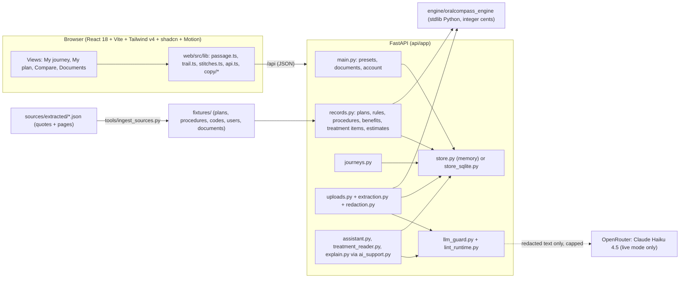
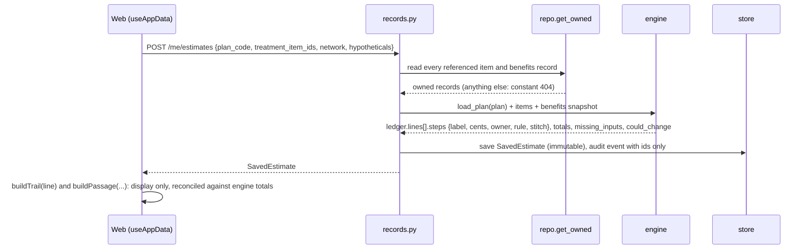
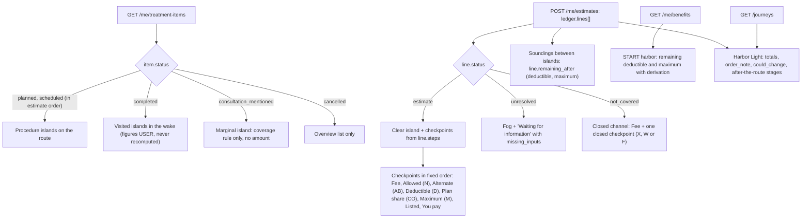
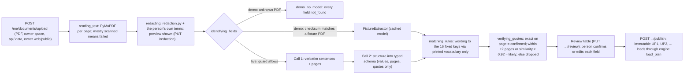
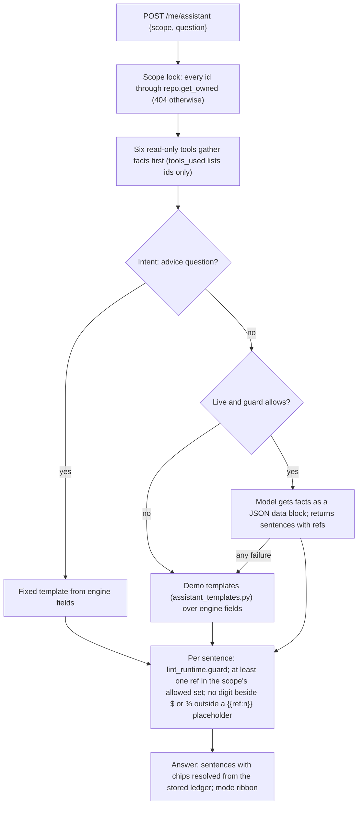
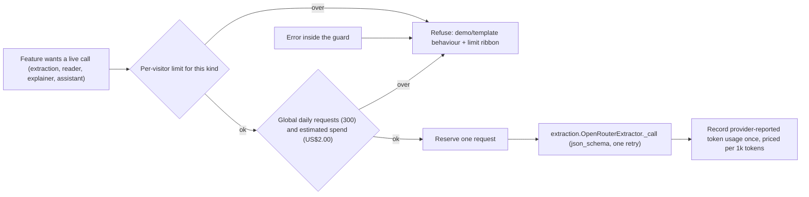

# OralCompass architecture

How the pieces fit, where every number comes from, what a model can and cannot touch, and how the product was built. Module names are
the files in this repository; the governing details live in `docs/ORALCOMPASS_DESIGN_SPEC.md` (+ addendum), `docs/ORALCOMPASS_DATA_MODEL.md`
and `docs/SECURITY.md`.

## 1. System

- **Development:** `uvicorn app.main:app` on one port, Vite dev or preview on another with `/api` proxied (`web/vite.config.ts`;
  `ORALCOMPASS_API_TARGET` overrides the target). Dev auth reads an `X-Dev-User` header.
- **Production shape (not deployed):** `api/app/server.py` serves the API under `/api` and `web/dist` at `/` from one container
  (`Dockerfile`, `railway.json`), with signed HttpOnly session cookies (`sessions.py`), CSP and body limits (`security.py`) and the SQLite store.

## 2. Request flow: one estimate

The web layer never computes a new amount. `lib/trail.ts` sums the steps for display and checks the sum against the engine's
`patient_cents` and `plan_cents`, showing "Amounts reconcile" or "do not reconcile".

## 3. The Passage: data to map

All derivations are pure functions in `web/src/lib/passage.ts` (unit-tested against captured Alex and Sam payloads in
`web/src/__fixtures__/passage/`). Spec §3 is the full table.

Route order equals ledger order, which is the order the engine consumed the deductible and annual maximum; it is causal, so it is not
user-sortable. Each checkpoint carries its evidence badge or a stitch (`ML26#p25`) that opens the ClauseCard and the Documents page.

## 4. Upload and extraction pipeline

Document text is data. Sentences addressed to automated readers (the fictional fixtures carry one on p.11) are removed from every quote and
listed under `structure.ignored_wording`. No document text, filename, quote or amount is logged.

## 5. Assistant guardrails

The assistant never computes money; amounts come only from the engine's stored ledger through `{{ref:n}}` placeholders. The treatment-plan
reader and clause explainer follow the same pattern (redact, guard, verify against the source text, fall back to a template) and are
described in `README.md` and `docs/SECURITY.md`.

## 6. LLM cost guard

Per-visitor limits by kind: extraction 5 per UTC day, reader 10 per day, explainer 60 per day, assistant 30 per 10-minute window, other
kinds 20 per day; every limit and cap is an environment variable (`api/app/llm_guard.py`). An unknown model is priced high rather than free.
The guard fails closed on spend. The in-process limiters in `ai_support.py` also apply in demo mode, since PDF parsing costs CPU.

## 7. Test safety

`api/tests/conftest.py` sets `ORALCOMPASS_LLM_PROVIDER=none` and clears `OPENROUTER_API_KEY` before the app imports, and
`load_dotenv(override=False)` never replaces an existing variable, so a live `api/.env` cannot switch the suite to live calls. Tests that
mock a live call bring their own fake key and `httpx.MockTransport`; a real call needs `@pytest.mark.live_llm` and
`ORALCOMPASS_ALLOW_LIVE_LLM=1`. The suite runs on both the memory and the SQLite store.

## 8. How it was built

```mermaid
flowchart LR
  B["Owner's brief (MASTER_BUILD_PROMPT_V2)"] --> P["Design panel: parallel concept agents"]
  P --> S["Design spec (ORALCOMPASS_DESIGN_SPEC)"]
  S --> AD["Addendum: owner concerns override (AI features, cost guard, production)"]
  AD --> CP["Component plan with anti-slop rules and acceptance"]
  CP --> WB["Parallel worktree builds (foundation, journey, plan, upload + assistant, API, AI features)"]
  WB --> RL["Review lenses + skeptic verifiers"]
  RL --> FX["Per-area fix branches"]
  FX --> FN["Parallel finish (fixes, docs, screenshots) then integration and provers"]
```

1. **Design panel.** Several agents proposed directions against the brief; the selected direction became the painted-atlas Passage.
2. **Spec.** `docs/ORALCOMPASS_DESIGN_SPEC.md` fixed the data-to-map mapping, layouts, states with exact copy, motion vocabulary,
   accessibility and the demo script, with file ownership and frozen shared interfaces for parallel work.
3. **Addendum.** `docs/ORALCOMPASS_DESIGN_SPEC_ADDENDUM.md` records the owner's later decisions; where it and the spec disagree, the addendum wins.
4. **Component plan.** `docs/ORALCOMPASS_COMPONENT_PLAN.md` lists every component, the vendored sources (`web/THIRD_PARTY_NOTICES.md`) and
   the anti-slop rules checked by grep (§4) and acceptance checks (§6).
5. **Parallel worktree builds.** Each area was built in its own git worktree and branch against the frozen interfaces, then merged into
   `build/journey-v2`.
6. **Review lenses and skeptics.** Reviewers read the merged build through separate lenses (information-only copy, evidence, accessibility,
   security, motion, data); skeptic agents re-verified each finding before it became a fix item (`docs/BUILD_FOLLOWUPS.md`).
7. **Per-area fixes, then a parallel finish.** Fix branches per area, merged with the full check suite: engine and API pytest, web build
   and tests, the ingest check, the advice linter, and the screenshot and layout walks on desktop and phone.
