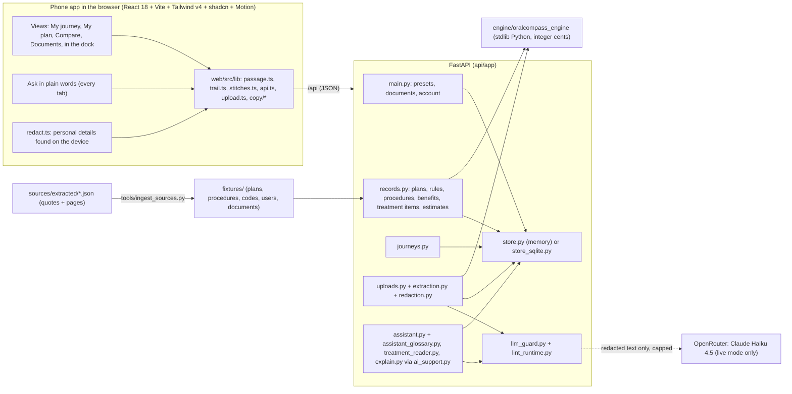
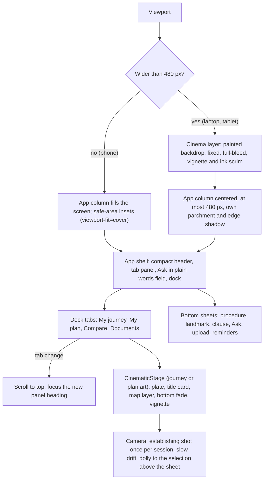
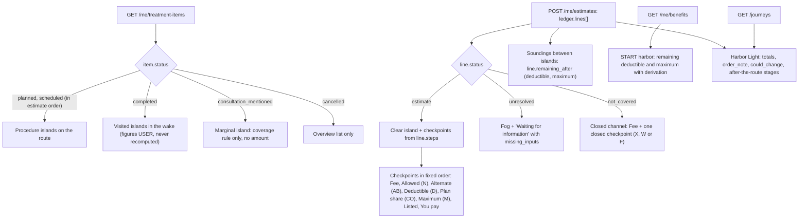
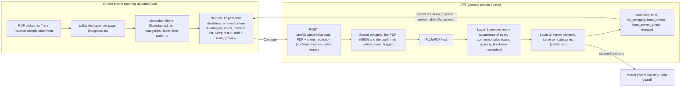
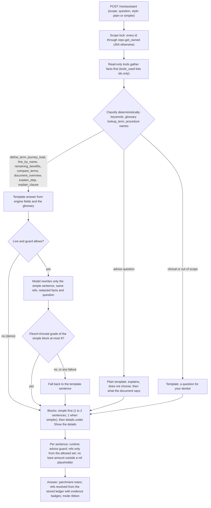
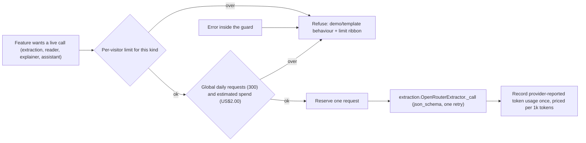

# OralCompass architecture

How the pieces fit, where every number comes from, what a model can and cannot touch, and how the product was built. OralCompass is a
mobile app: the phone layout is the only layout (section 2). Module names are
the files in this repository; the governing details live in `docs/ORALCOMPASS_DESIGN_SPEC.md` (+ addendum), `docs/ORALCOMPASS_DATA_MODEL.md`
and `docs/SECURITY.md`.

## 1. System

<!-- verify: feat/client-redaction (redact.ts) and feat/ask-plain (Ask in plain words, assistant_glossary.py) in the diagram above -->

- **Development:** `uvicorn app.main:app` on one port, Vite dev or preview on another with `/api` proxied (`web/vite.config.ts`;
  `ORALCOMPASS_API_TARGET` overrides the target). Dev auth reads an `X-Dev-User` header.
- **Production shape (not deployed):** `api/app/server.py` serves the API under `/api` and `web/dist` at `/` from one container
  (`Dockerfile`, `railway.json`), with signed HttpOnly session cookies (`sessions.py`), CSP and body limits (`security.py`) and the SQLite store.

## 2. The mobile-only shell

<!-- verify: feat/mobile-cinematic (this whole section) -->

OralCompass is an installable web app (`web/public/manifest.webmanifest`, `display: standalone`) and the phone layout is the only layout.
There is no desktop top nav, side column, two-column view or desktop drawer: the dock, bottom sheets (vaul) and phone views render at every
width. On a screen wider than 480 px the same app sits in a centered column and the painted journey fills the window behind it.

- **Native feel.** `apple-mobile-web-app-capable`, status-bar style, `apple-touch-icon`, `theme-color`; overscroll disabled on the shell;
  a designed pressed state instead of the tap highlight; inputs at 16 px or more (no iOS zoom); no hover-only affordances; the keyboard
  never covers an input (`visualViewport`).
- **CinematicStage** (`web/src/components/atlas/CinematicStage.tsx`) is shared by My journey (the vertical Passage) and My plan (the five
  landmarks on the coast route). No box, border or radius around a map; the plate fades into the parchment at its bottom edge.
- **Motion budget.** Transform and opacity only; the drift pauses when the document is hidden; reduced motion shows the end states. The
  route draw is registered once per session (`lib/drawRegistry`).
- **Not offline.** The service worker (`web/public/sw.js`) is for optional Web Push reminders only and caches nothing.

## 3. Request flow: one estimate

The web layer never computes a new amount. `lib/trail.ts` sums the steps for display and checks the sum against the engine's
`patient_cents` and `plan_cents`, showing "Amounts reconcile" or "do not reconcile".

## 4. The Passage: data to map

All derivations are pure functions in `web/src/lib/passage.ts` (unit-tested against captured Alex and Sam payloads in
`web/src/__fixtures__/passage/`). Spec §3 is the full table.

Route order equals ledger order, which is the order the engine consumed the deductible and annual maximum; it is causal, so it is not
user-sortable. Each checkpoint carries its evidence badge or a stitch (`ML26#p25`) that opens the ClauseCard and the Documents page.

## 5. Redaction before AI analysis

<!-- verify: feat/client-redaction (this whole section and the pipeline below) -->

Personal details are found and reviewed on the device before upload, removed again on the server before any model call, and counted.
Details, categories and known gaps: `docs/SECURITY.md` ("Redaction before AI analysis").

## 6. Upload and extraction pipeline

```mermaid
flowchart LR
  P["Device: personal details found and reviewed (section 5)"] --> U["POST /me/documents/upload (PDF + client_redaction, owner space, never web/public)"]
  U --> RT["reading_text: PyMuPDF per page; mostly scanned means failed"]
  RT --> RD["redacting: confirmed values, then server patterns and the person's own terms (PUT .../redaction)"]
  RD --> ID{"identifying_fields"}
  ID -- "demo: checksum matches a fixture PDF" --> FX["FixtureExtractor (cached model)"]
  ID -- "demo: unknown PDF" --> NM["demo_no_model: every field not_found"]
  ID -- "live: guard allows" --> M1["Call 1: verbatim sentences + pages"]
  M1 --> M2["Call 2: structure into typed schema (values, pages, quotes only)"]
  FX & M2 --> MR["matching_rules: wording to the 16 fixed keys via printed vocabulary only"]
  MR --> VQ["verifying_quotes: exact on page = confirmed; within ±2 pages or similarity ≥ 0.92 = likely; else dropped"]
  VQ --> RV["Review table (PUT .../review): person confirms or edits each field"]
  RV --> PB["POST .../publish: immutable UP1, UP2, ... loads through engine load_plan"]
```

Document text is data. Sentences addressed to automated readers (the fictional certificates carry one on p.11) are removed from every
quote and listed under `structure.ignored_wording`. No document text, filename, quote, identifier or amount is logged. The fictional sample
statement (`fixtures/documents/tw26_fictional_sample_statement.pdf`) has a demo extraction fixture keyed by its SHA-256, so demo mode runs
this whole pipeline with no key. <!-- verify: feat/client-redaction -->

## 7. Ask in plain words: the assistant pipeline

<!-- verify: feat/ask-plain (this whole section) -->

One pipeline serves the "Ask in plain words" box on every tab (scope: the current plan, the journey's estimate and the journey) and the
scoped "Ask about this step" in the procedure sheet and clause card.

- **Simple terms first.** Every answer's first block (`kind: "simple"`) is one or two short sentences at about an 8th-grade level, with
  insurance words explained in passing; the existing steps, clauses and where-from blocks sit under "Show the details", closed by default.
- **Glossary.** `api/app/assistant_glossary.py` holds `GLOSSARY[key] = {term, aka, simple, simpler, plan_field}` and `lookup_term`
  (case-insensitive, plural, possessive and spelling tolerant, linear-time). Definitions carry no numbers; when the plan states the value,
  the answer adds the plan's own figure as a ref with its DOC badge and stitch.
- **Say it more simply** re-asks with `style: "simpler"`: a second template variant in demo mode, a stricter one-sentence prompt in live mode.

The assistant never computes money; amounts come only from the engine's stored ledger through `{{ref:n}}` placeholders. The treatment-plan
reader and clause explainer follow the same pattern (redact, guard, verify against the source text, fall back to a template) and are
described in `README.md` and `docs/SECURITY.md`.

## 8. LLM cost guard

Per-visitor limits by kind: extraction 5 per UTC day, reader 10 per day, explainer 60 per day, assistant 30 per 10-minute window, other
kinds 20 per day; every limit and cap is an environment variable (`api/app/llm_guard.py`). An unknown model is priced high rather than free.
The guard fails closed on spend. The in-process limiters in `ai_support.py` also apply in demo mode, since PDF parsing costs CPU.

## 9. Test safety

`api/tests/conftest.py` sets `ORALCOMPASS_LLM_PROVIDER=none` and clears `OPENROUTER_API_KEY` before the app imports, and
`load_dotenv(override=False)` never replaces an existing variable, so a live `api/.env` cannot switch the suite to live calls. Tests that
mock a live call bring their own fake key and `httpx.MockTransport`; a real call needs `@pytest.mark.live_llm` and
`ORALCOMPASS_ALLOW_LIVE_LLM=1`. The suite runs on both the memory and the SQLite store.

## 10. How it was built

```mermaid
flowchart LR
  B["Owner's brief (MASTER_BUILD_PROMPT_V2)"] --> P["Design panel: parallel concept agents"]
  P --> S["Design spec (ORALCOMPASS_DESIGN_SPEC)"]
  S --> AD["Addendum: owner concerns override (AI features, cost guard, production)"]
  AD --> CP["Component plan with anti-slop rules and acceptance"]
  CP --> WB["Parallel worktree builds (foundation, journey, plan, upload + assistant, API, AI features)"]
  WB --> RL["Review lenses + skeptic verifiers"]
  RL --> FX["Per-area fix branches"]
  FX --> FN["Parallel finish (fixes, docs, screenshots) then integration and provers"]
  FN --> ND["Owner direction: mobile-only, cinematic maps, redaction before AI, Ask in plain words (parallel feature branches)"]
```

1. **Design panel.** Several agents proposed directions against the brief; the selected direction became the painted-atlas Passage.
2. **Spec.** `docs/ORALCOMPASS_DESIGN_SPEC.md` fixed the data-to-map mapping, layouts, states with exact copy, motion vocabulary,
   accessibility and the demo script, with file ownership and frozen shared interfaces for parallel work.
3. **Addendum.** `docs/ORALCOMPASS_DESIGN_SPEC_ADDENDUM.md` records the owner's later decisions; where it and the spec disagree, the addendum wins.
4. **Component plan.** `docs/ORALCOMPASS_COMPONENT_PLAN.md` lists every component, the vendored sources (`web/THIRD_PARTY_NOTICES.md`) and
   the anti-slop rules checked by grep (§4) and acceptance checks (§6).
5. **Parallel worktree builds.** Each area was built in its own git worktree and branch against the frozen interfaces, then merged into
   `build/journey-v2`.
6. **Review lenses and skeptics.** Reviewers read the merged build through separate lenses (information-only copy, evidence, accessibility,
   security, motion, data); skeptic agents re-verified each finding before it became a fix item (`docs/BUILD_FOLLOWUPS.md`).
7. **Per-area fixes, then a parallel finish.** Fix branches per area, merged with the full check suite: engine and API pytest, web build
   and tests, the ingest check, the advice linter, and the screenshot and layout walks.
8. **The new direction, in parallel.** The owner then set four directions: a mobile-only app, cinematic full-bleed maps, personal details
   removed before AI analysis, and a plain-words prompt box on every tab. Each was built on its own feature branch
   (`feat/mobile-cinematic`, `feat/client-redaction`, `feat/ask-plain`) against a written contract and integrated into `build/journey-v2`
   with the full check suite on phone devices. <!-- verify: integration of feat/mobile-cinematic, feat/client-redaction, feat/ask-plain -->
